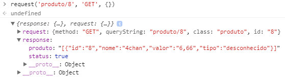
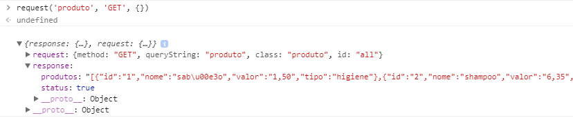

# API REST PHP
API REST simples utilizando PHP

1 - Clone o projeto para seu localhost

2 - Importe o Banco de Dados (banco-dados/super-mercado.sql)

3 - Configure a conexão do Banco de Dados no construtor da classe DB (src/model/db.class.php)

4 - Abra http://localhost/api-rest-php/src/request.php no seu navegador

5 - Abra o console e use a função request(query, method, data)

## Exemplos
(pelo console do navegaador)

### GET por id

```
request('produto/8', 'GET', {})
```



### GET all

```
request('produto', 'GET', {})
```


### POST

```
request('produto', 'POST', {'nome':'camisa', 'valor':'49,90', 'tipo':'roupa'})
```


### DELETE

```
request('produto/1', 'DELETE', {})
```


